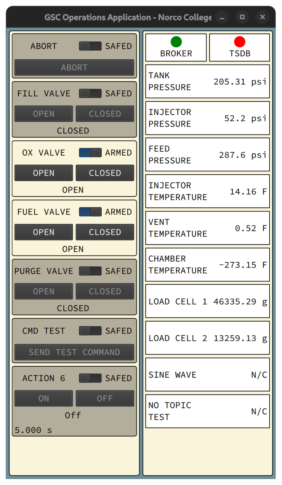

# GSC Operation Application
The Operations application is the commanding front-end for Norco College Rocketry's ground support equipment. It provides and interface for sending commands to the launch pad over MQTT and displays a limited set of safety critical indicators and telemetry values (such as propellant tank pressure).

This program will run on Raspberry Pi 5 within the Ground Station Control briefcase as part of the ground support equipment for NCR's first bi-propellant liquid rocket, [Project Olivine](https://github.com/orgs/Norco-College-Rocketry/projects/1?pane=info).



## Features

### Current Features
- Command arming
- Send commands over MQTT
- Display latest telemetry values
- Indicate server connection status

### Planned Features
- Settings page
- Somposable timed linear sequences
- Sequence editor

## Building

### Build Dependencies
- Qt 6
- Qt Quick
- Qt MQTT
- spdlog
- Google Test (optional, set the CMake option ENABLE_TESTS to OFF to disable unit tests)

### Compiling
For development, the preferred method of compiling is through Qt Creator.

However, to do so in the command line run:
```bash
$ cmake -B build
$ cmake --build build
$ ./build/appGSC_Operation
```